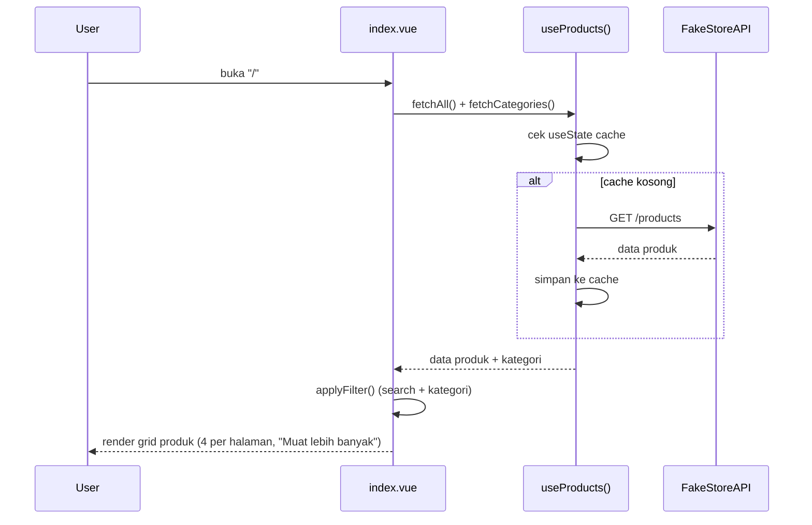
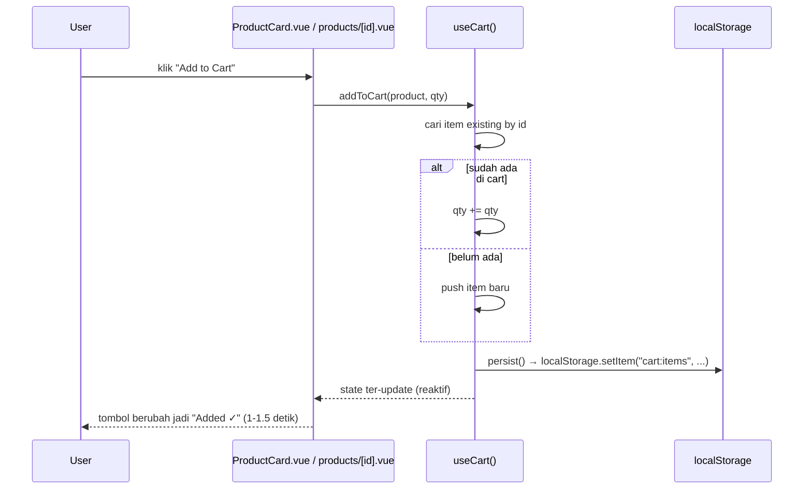
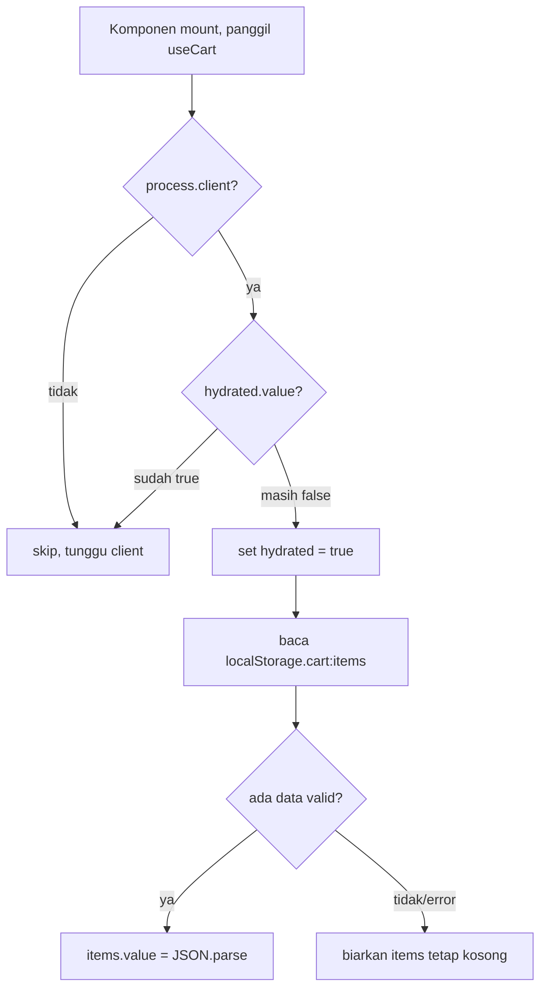

# Alur Aplikasi (Flow)

Dokumen ini menjelaskan alur data dan interaksi pengguna untuk fitur-fitur utama.

## 1. Browse Produk (Home)

Search (`SearchBar.vue`) dan filter kategori (`CategoryFilter.vue` / klik kategori di `Navbar.vue`) menulis ke `useState` bersama (`global:q`, `nav:selectedCat`). `index.vue` men-`watch` keduanya lalu memanggil ulang `applyFilter()` — tidak ada refetch ke API, filter dilakukan di memori atas data yang sudah di-cache.

## 2. Kategori & Detail Produk

- `/category/[slug]` memanggil `fetchByCategory(slug)`, hasilnya di-cache per slug (`cat:<slug>`), lalu dipaginasi sama seperti home.
- `/products/[id]` memanggil `fetchById(id)` lewat `useAsyncData` (SSR), sehingga detail produk sudah ter-render di HTML awal (baik untuk SEO/meta tag lewat `useHead`).

## 3. Cart — Menambahkan Produk

Karena `items` disimpan lewat `useState("cart:items", ...)`, setiap komponen yang memanggil `useCart()` — `ProductCard`, halaman detail produk, `Navbar`, dan `cart.vue` — berbagi instance state yang sama. Badge jumlah item di `Navbar.vue` (`totalItems`) otomatis ikut update tanpa event manual.

## 4. Cart — Hydration dari localStorage

Flag `cart:hydrated` (juga `useState`) mencegah proses read-localStorage berjalan berkali-kali ketika banyak `ProductCard` memanggil `useCart()` sekaligus di satu halaman.

## 5. Cart — Halaman `/cart`

1. Menampilkan seluruh `items` dari `useCart()`.
2. Tiap item punya stepper qty (`updateQty`) — qty 0 otomatis memanggil `removeFromCart`.
3. `totalPrice` dihitung reaktif (`computed`) dari `items`.
4. Tombol **Checkout** memanggil `clearCart()` dan menampilkan pesan sukses sementara (simulasi — tidak ada backend order/payment sungguhan, karena FakeStoreAPI tidak mendukung ini secara nyata).

## 6. Dark Mode

`useTheme()` membaca `localStorage.theme`, fallback ke `prefers-color-scheme`, lalu toggle class `dark` di `<html>`. Pola hydrate → persist ini identik dengan yang dipakai `useCart`.
